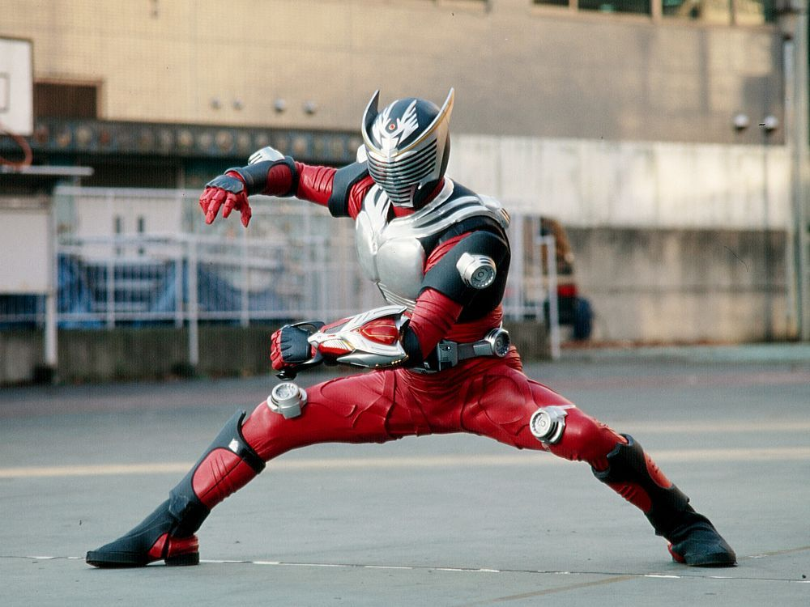
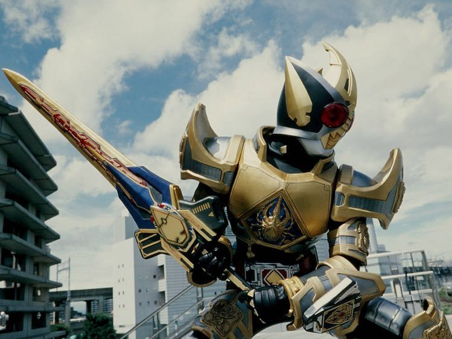

<!-- 右上角那张图要排在最前面，float 才会把它顶到右上角；
     放在社交图标后面的话会被挤到它们下面一行。 -->

  

**`Software Engineering Student`** `|` **`Mobile App Developer`**

Hi, I'm **Jun Hao**, a software engineering student at TARUMT working toward backend software
engineering. I spent my industrial training in the R&D department at Deng Kai Sdn Bhd
building React Native apps that talk to hardware over BLE, Wi-Fi and MQTT, and I build
my own apps in Flutter — most recently an offline music player for Android.
Away from the keyboard, I'm into Kamen Rider and anime.

 

<picture>
  <source
    media="(prefers-color-scheme: dark)"
    srcset="https://raw.githubusercontent.com/Hao0819/Hao0819/output/github-snake-dark.svg"
  />
  <source
    media="(prefers-color-scheme: light)"
    srcset="https://raw.githubusercontent.com/Hao0819/Hao0819/output/github-snake.svg"
  />
  
</picture>

## My Tech Stack

### Languages

### Mobile

### Backend & Tools

## GitHub Stats

<picture>
  <source
    media="(prefers-color-scheme: dark)"
    srcset="https://streak-stats.demolab.com/?user=Hao0819&hide_border=true&border_radius=10&mode=daily&card_width=500&card_height=200&background=0D1117&ring=0E69BB&fire=0E69BB&currStreakLabel=0E69BB&currStreakNum=FFFFFF&sideLabels=FFFFFF&sideNums=FFFFFF&dates=8B8B8B&border=30363D"
  />
  <source
    media="(prefers-color-scheme: light)"
    srcset="https://streak-stats.demolab.com/?user=Hao0819&hide_border=true&border_radius=10&mode=daily&card_width=500&card_height=200&background=FFFFFF&ring=0E69BB&fire=0E69BB&currStreakLabel=0E69BB&currStreakNum=1A1A1A&sideLabels=1A1A1A&sideNums=1A1A1A&dates=666666&border=E1E4E8"
  />
  
</picture>

<!-- Rendered daily by .github/workflows/metrics.yml (lowlighter/metrics) -->

## Off-hours

Some of my favourites.

<!-- Ryuki 在最上面的右上角，这里就不重复放了。
     三张一排共约 745px，在 README 正文宽度内，不会折行。 -->
<table>
  <tr>
    <td align="center">
      
    </td>
    <td align="center">
      
    </td>
    <td align="center">
      
    </td>
  </tr>
  <tr>
    <td align="center"><b>Kamen Rider Blade</b></td>
    <td align="center"><b>Goku</b> · Dragon Ball</td>
    <td align="center"><b>Hibari Kyoya</b> · Hitman Reborn</td>
  </tr>
</table>

⭐ If you find something useful in my repositories, a star is always appreciated!
